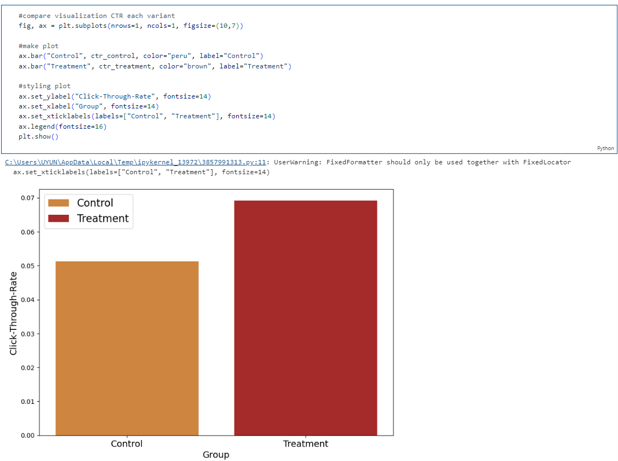
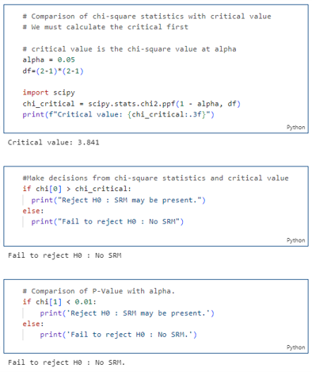
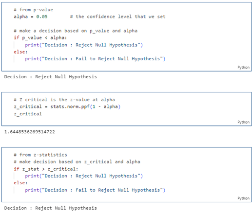
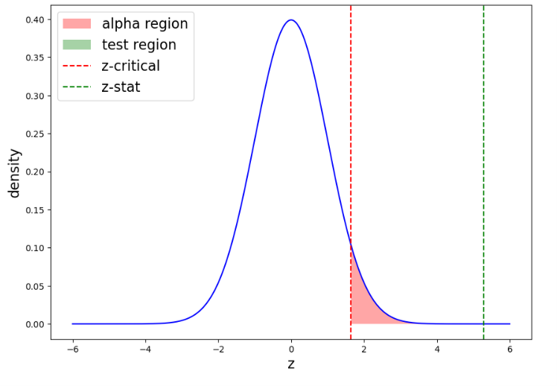

# Website of the Grocery Store Chain - Experimental Design and A/B Testing
---
### -  Introduction/Background
There is a large grocery chain. The company’s goal is to drive more customers to download the mobile app and register for the loyalty program. The manager is curious if  changing the link to a button of the app store will improve the user’s ability to download the app.

### - Setting Up Problem
1. Experiment Goal
2. Choosing Metrics
3. Define Variants
4. Define Hypothesis

### - Designing Experiments
1. Randomization Unit
2. Target of Randomization Unit
3. Sample Size

**Comparison of CTR on each variant**

**Detection of SRM**

**The statistical test results**

**Visualize The statistical test results**

